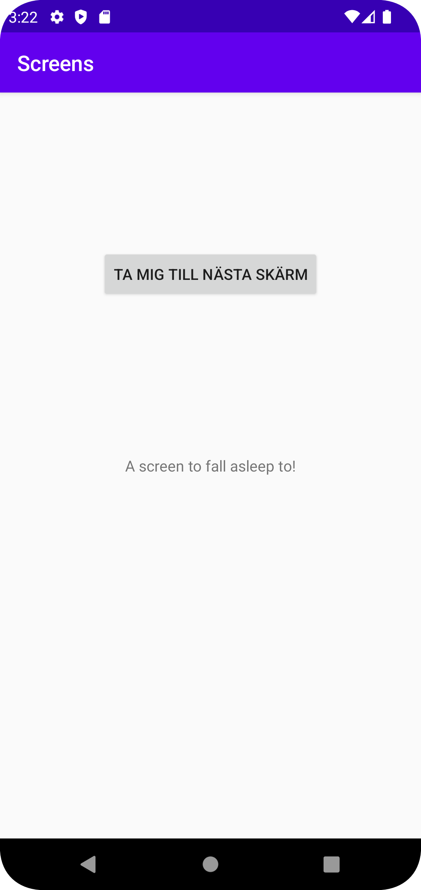
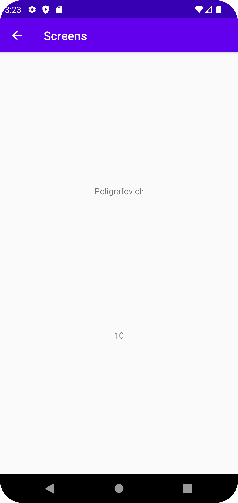

# Rapport
Jag har lagt till en ny SecondActivity vid sidan av min MainActivity. I min MainActivity lade jag till en knapp som jag sedan tilldelade en onClick listener (i mainactivity.java) som vid ett klick tar användaren till den andra activityn. Jag ändrade även i manifestfilen där jag gjorde MainActivity till SecondActivitys parent, vilket tillåter en att backa på skärmen med en tillbakapil. Sedan lade jag till två textViews i min SecondActivity och gav dem constraints, namn och textinnehåll. Jag använde intents i MainActivity.java-listenern för att möjliggöra dataöverföring mellan MainActivity och SecondActivity vid knapptryckningen. Slutligen adderade jag bundle extras till SecondActivity.java där kopplade mina två textViews i kod till "name" och "number" som skapades och tilldelades data i MainActivity.java.

```
Button knapp=findViewById(R.id.buttonToNextScreen);
knapp.setOnClickListener(new View.OnClickListener() {
            @Override
            public void onClick(View view) {
                Intent intent = new Intent(MainActivity.this, SecondActivity.class);
                intent.putExtra("name", "Poligrafovich");
                intent.putExtra("number", 10);
                startActivity(intent);
}
```




